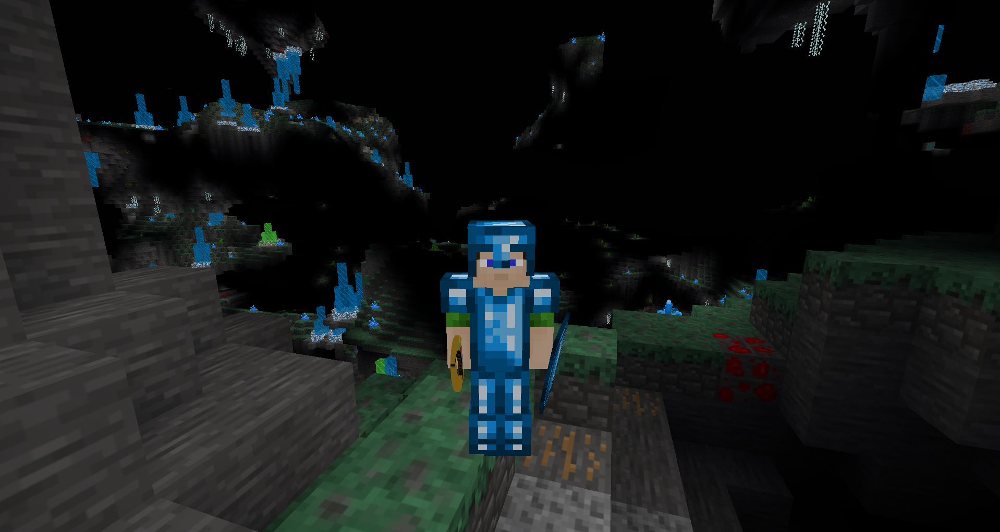

# Rings
Minetest mod that adds rings with temporary player effects

*  _Celestial Ring_ : allows to fly
  

*  _Infernal Ring_ : gives fire resistance
  

*  _Abyssal Ring_ : gives water resistance
  

*  _Hardening Ring_ : gives Iron Fist (via Activation Ring)

*  _Enlightning Ring_ : makes player shine
  
  

*  _Activation Ring_ : provides control of the rings:
  - activates/desactivates the rings (primary/secondary usage) ;
  - applies special effects (cf. Iron Fist) ;
  - in sneak mode: toggles automatic activation/toggles hud (primary/secondary usage).

*  _Random Ring_ : drops a random ring

Glooptest mod dependency was made optional by including part of its code.
